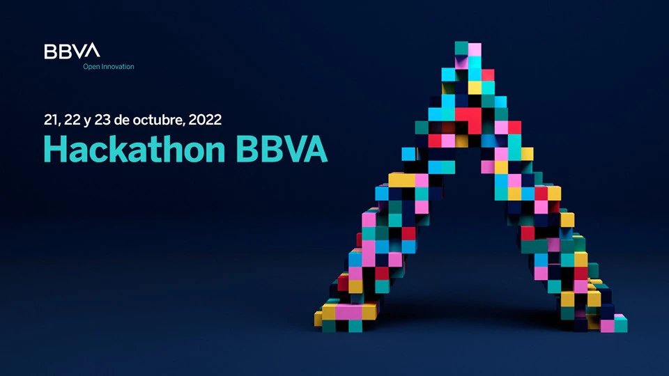
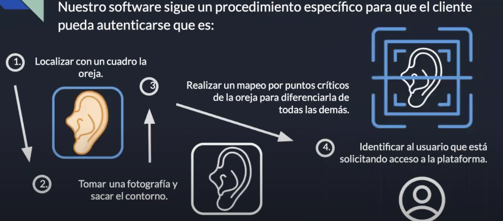
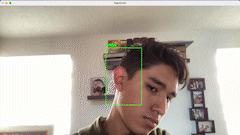
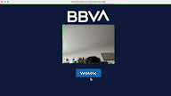

# ****Autenticación para todos****



Puedes checar el video sobre el proyecto [aqui.](https://youtu.be/32tMEkpsjVM)

Nuestra propuesta con este programa consiste en autenticar a los clientes usando la biometría de la oreja, esto, puesto que los clientes presentan una mayor dificultad al interaccionar con los otros métodos de autenticación ya existes, como equipo queremos desarrollar una forma simple , pero segura con la que los clientes puedan realizar sus actividades bancarias sin tener mayor inconveniente.

El uso de la biometría de oreja es una forma de autenticación que es superior a otras biometrías porque la oreja no cambia entre los 20 y 60 años en promedio, la oreja es uno de nuestros sensores, entonces generalmente está descubierta, y anatómicamente la oreja es única, no hay dos orejas iguales.

## **Objetivo**

En este momento hay bastantes personas que no se pueden identificar con los métodos que existen hoy en día, esto qué quiere decir que, por ejemplo, el 48% de las personas de la tercera edad no se puede identificar con la huella dactilar porque las huellas se van borrando constantemente a través del tiempo, o por ejemplo una persona parapléjica no cuenta con la capacidad para poder autenticarse a través del método facial ya que este requiere que parpadees. 

Queremos presentarles un cuarto método de identificación enfocado a personas con cierta discapacidad para que podamos ayudarlos a través de la biometría de oreja.


## **Desarrollo**

El proyecto cuenta con una fase que es encuadrar tu oreja así como lo hace un reconocimiento facial, luego se toma una fotografía de esta y se agrega un contorno para poder enfocar cada una de las partes que se están buscando identificar de la oreja, finalmente se realizar un mapeo con los puntos críticos de la oreja para poder saber cuál específicamente es la del usuario y así poderlo identificar.



Para este proyecto se utilizaron las bibliotecas de **opencv-python** y **imutils**

```bash
pip install opencv-python
pip install imutils
```

## **Demo**





## **Autores**

- [Jorge Juarez](https://github.com/jorge-jrzz)
- [Santiago Camarena](https://github.com/camarenaS100)
- [Santiago Bocanegra](https://github.com/Sbdk24)
- [Michelle Brady](https://github.com/michellebrady08)
- [Iñaki Garcia](https://github.com/InakiGT)
- [Misael Alvarez](https://github.com/Misael-Alvarez)

## **Agradecimientos**

Agradecemos al equipo de [BBVA Open Innovation](https://openinnovation.bbva.com/es/) por brindarnos esta oportunidad y hacernos crecer como desarrolladores de software, pero sobre todo como personas.

## **Estatus**

Este proyecto fue realizado por el equipo Panteras para la participación en el Hackathon BBVA 2022, el cual se llevo a cabo del 21 al 23 de Octubre de 2022, no existen intenciones de actualizar el código en el futuro.

## **Licencia**

[MIT](https://choosealicense.com/licenses/mit/)